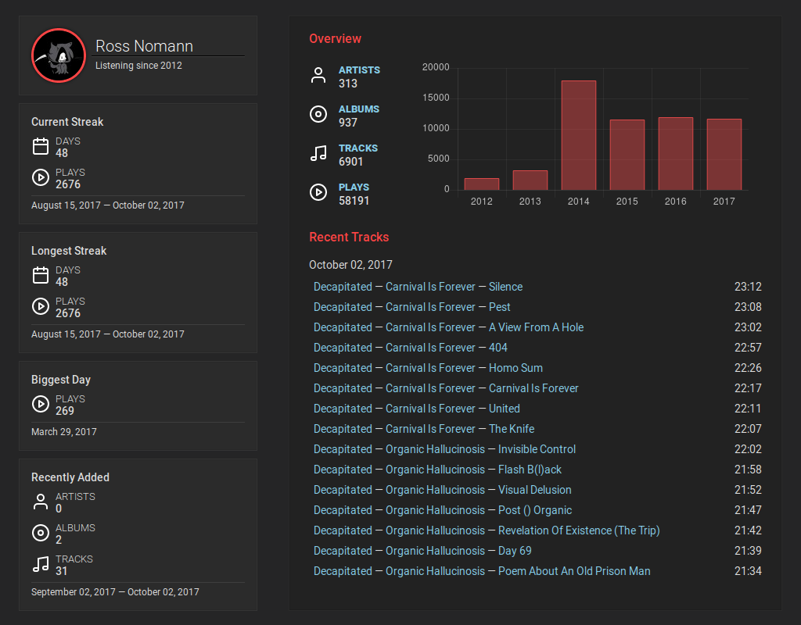

# Introduction

**Playlog** is a self-hosted scrobbling[^scrobbling] server.
It allows you to collect and view the statistics of scrobbles.
Unlike other services (last.fm, libre.fm) playlog is intended for the sole use.
This means you are not albe to create more than one account.
At this moment it supports legacy [Submissions API](http://last.fm/api/submissions)
only. So some music players won't work.
There are plans to create a custom API with proxies
for Submissions and [Scrobbling API](https://www.last.fm/api/scrobbling) support.

Let's see how it looks like:

If you are interested, go to the next section and try!

[^scrobbling] Scrobbling is a term invented by Last.fm to describe the logging of songs that
you listen to.
